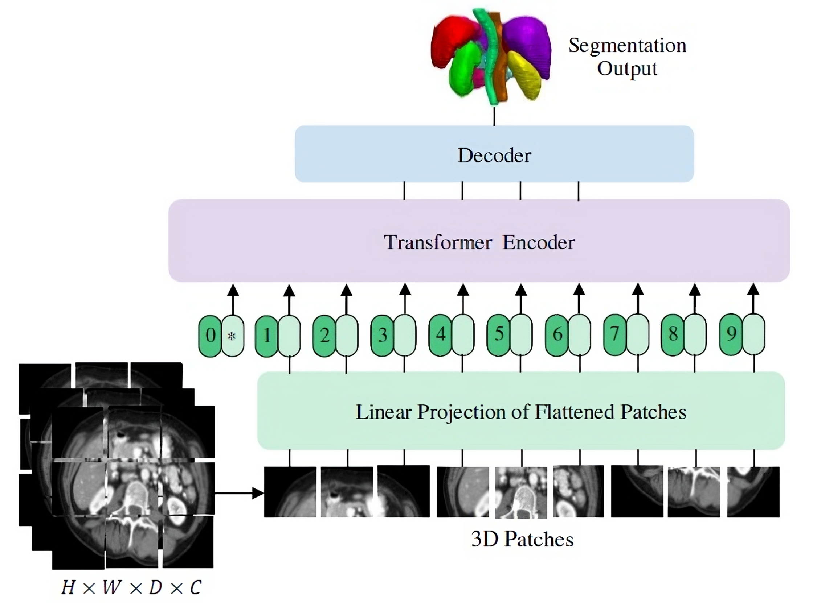
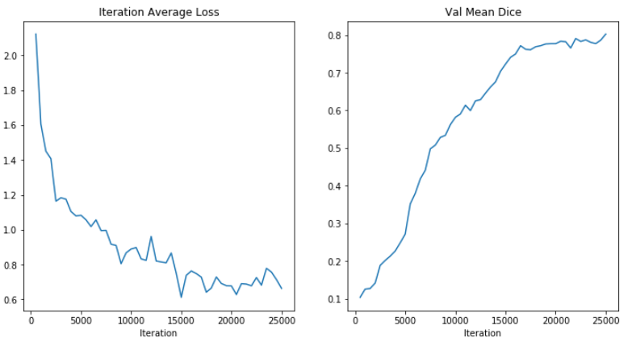
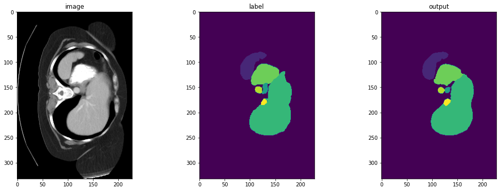
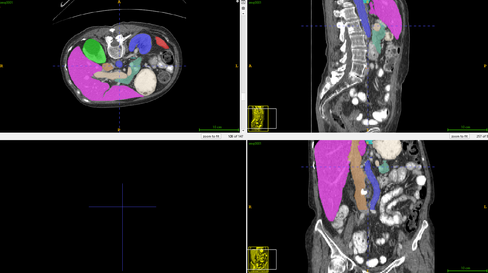

<div align="center">

# UNETR // 3D ABDOMEN SEGMENTATION

**Transformer-encoder UNETR for multi-organ 3D abdominal CT segmentation, in PyTorch + MONAI.**


</div>

---

**UNETR** (UNEt TRansformers) segments 14 abdominal structures from 3D CT volumes. A ViT encoder tokenizes the volume into 16³ patches and processes them with pure self-attention; skip connections at four depths feed a CNN decoder that reconstructs a full-resolution voxel segmentation — a transformer's global receptive field with a U-Net's localization.

<p align="center"></p>

## Method

| Component | Setting |
| :--- | :--- |
| Backbone | UNETR — 1 → 14 channels, `128³` input, hidden 768, MLP 3072, 12 heads, instance norm, residual blocks |
| Preprocessing (MONAI) | RAS orientation, `1.5×1.5×2.0 mm` spacing, HU window `[-200, 200]`, foreground crop |
| Sampling | `RandCropByPosNegLabel` 128³ (pos/neg balanced), random flip + 90° rotation |
| Loss / opt | Dice loss (softmax) · Adam `1e-4` |
| Inference | sliding-window over the full volume, Dice metric |

## Results

**Validation Dice: 0.8027** across the 14 classes.

<p align="center">

</p>
<p align="center">

</p>
<p align="center">

</p>

Left-to-right in `viz.png`: input CT slice, ground-truth labels, model prediction. `itk_patient.png` shows the predicted labelmap rendered in ITK-SNAP.

## Reproduce

Requires a CUDA GPU and the BTCV-style dataset laid out under `data/` (`imagesTr/`, `labelsTr/`, `dataset_0.json`).

```bash
pip install -r requirements.txt
python src/train.py --data_dir data/ --epochs 100 --batch_size 2
python src/evaluate.py --data_dir data/ --model_path models/model_epoch_100.pth
```

## Repository layout

```
src/
  data_loader.py  MONAI transforms + train/val split
  model.py        UNETR configuration
  train.py        training loop, Dice loss, checkpointing
  evaluate.py     sliding-window inference + Dice
  utils.py        checkpoint save/load
  visualize.py    image / label / prediction slice viewer
data/dataset_0.json   dataset manifest
```

## Limitations

Single split, no cross-validation or test-set report — the 0.80 Dice is validation-set only. Trained at one resolution/patch size without deep-supervision or ensembling, so it's a solid baseline rather than a tuned result. *A fuller revamp (per-organ Dice, augmentation sweep, proper test split) is planned.*

## References

[UNETR: Transformers for 3D Medical Image Segmentation](https://arxiv.org/abs/2103.10504) (Hatamizadeh et al., WACV 2022) · [MONAI](https://monai.io/) · BTCV multi-organ abdominal CT

MIT — see [`LICENSE`](LICENSE).
